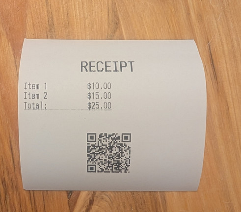

# escpos2mqtt

This is a service to connect ESC/POS compatible receipt printers to a MQTT broker.
Use this in your smart home or for printing receipts!

Further documentation [can be found here](https://jhbruhn.github.io/escpos2mqtt/).

There also is a HomeAssistant Add-On at `https://github.com/jhbruhn/escpos2mqtt-hassio`.

This server allows you to print receipts using _programs_ sent via MQTT.
Programs look like this:

```
justify center
bold true
size 2,2
writeln "RECEIPT"
reset_size
bold false
feed 1
justify left
writeln "Item 1          $10.00"
writeln "Item 2          $15.00"
underline single
writeln "Total:          $25.00"
underline none
feed 2
justify center
qr_code "https://example.com/receipt/12345"
feed 2
cut
```

which produces a result like this:



## License

This project is licensed under the MIT license (LICENSE.md or http://opensource.org/licenses/MIT).
